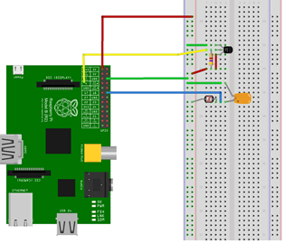
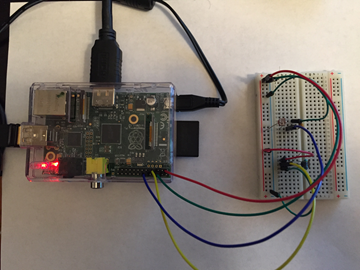

# Raspberry Pi Sample Code
Sample code for demonstrating simple data logging from DS18B20 Temperature Sensor and Analog photoresistor

Raspberry Pi only has digital input pins so we can connect the analog photoresistor to the GPIO pin via an ADC or directly to the pins playing some tricks.

**RaspberryPiSensorCode** - This directory contains two python files that reads values just from the temperature sensor and then from the temperature and light sensor and displays in the console window.

**RaspberryPiSensorCodeDB** - This directory contains one python file that reads values just from the temperature sensor and then from the temperature and light sensor and displays in the console window as well as using the urllib to send a get request to the addsensordata.php file which logs the data into the MySQL database.

**RaspberryPiSensorCodeDBTwitter** - This directory contains one python file that reads values just from the temperature sensor and then from the temperature and light sensor and displays in the console window as well as using the urllib to send a get request to the twittertest.php file which tweets the data. Note that the files for the MySQL database and Twitter versions are pretty much exactly the same except the URL for the HTTP GET Request.

The TwitterOAuth libraries are taken from the following location:
https://github.com/abraham/twitteroauth with further documentation located here: https://twitteroauth.com/

# Raspberry Pi Hardware Setup

# Tools / Software Used

For these examples, I was using an older Rasberry Pi B board...
